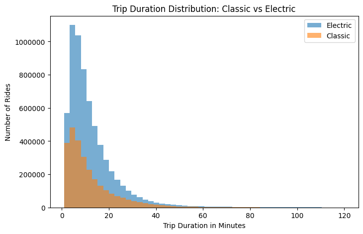

# Electric vs Classic Bikes  
### An A/B Analysis of Behavioral Impact Across User Segments

## Overview

This analysis evaluates whether **electric bikes change rider behavior** compared to classic bikes, and whether this effect differs between **members and casual users**.

Rather than focusing solely on statistical significance, I prioritize **practical impact and behavioral interpretation**, recognizing that large samples can make even small differences statistically significant but not necessarily meaningful.

The result is a **segment-specific understanding** of how electric bikes affect trip duration, with direct implications for pricing, positioning, and operations.

## Data
Data is from Citi Bike and can be found [here](https://citibikenyc.com/system-data). The range from May to June of 2025 was chosen for this analysis.

## Experiment Design

### Sampling Strategy

Due to computational constraints and diminishing analytical returns from extremely large samples, a **stratified random sample** was used.

The sample preserves the original distribution of:
- Rideable type (classic vs electric)
- User type (member vs casual)

This ensures the analysis remains **statistically robust** while computationally efficient.

---

### Experiment Setup

- **Metric:** Median trip duration  
- **Unit of analysis:** One ride = one observation  
- **Time window:** May–June 2025  

**Groups**
- Control (A): Classic bikes  
- Treatment (B): Electric bikes  

---

## Hypotheses

- **H₀ (Null):** There is no difference in trip duration between electric and classic bikes  
- **H₁ (Alternative):** Electric bikes have a different trip duration than classic bikes  

---

## Statistical Methodology

Trip duration is **heavily right-skewed** with a long right tail. Because this violates the assumptions of parametric tests, a **Mann–Whitney U test** was used.

The probability that the observed difference occurred by random chance is **effectively zero** (*p* ≈ 0).

Given the large sample size, **median differences** are used to assess **practical impact**, not statistical significance alone.

---

## Overall Effect (All Users)

Electric bikes increase **median trip duration by ~9%** compared to classic bikes.

**Interpretation:**  
The statistical effect is extreme, but the practical effect size is **moderate**. Electric bikes enable slightly longer trips without fundamentally changing overall usage patterns.

This motivates deeper segment-level analysis.

---

## Segment-Level Analysis: Members vs Casual Riders

### Casual Riders

- Classic bike median: **15.54 min**  
- Electric bike median: **12.41 min**  
- **Effect:** Electric rides are ~**20% shorter**

**Behavioral interpretation:**
- Casual riders are likely tourists or leisure users  
- Electric bikes reduce effort and increase speed  
- Trips are completed more efficiently  

Shorter rides are therefore expected.

---

### Members

- Classic bike median: **7.67 min**  
- Electric bike median: **8.80 min**  
- **Effect:** Electric rides are ~**15% longer**

**Behavioral interpretation:**
- Members are likely commuters  
- Electric assistance makes longer commutes feasible  
- Riders extend their effective travel radius  

Longer rides are therefore expected.

---

## Key Finding

**Electric bikes reduce trip duration for casual riders but increase trip duration for members.**

### Evidence Summary

- Casual median ↓ ~20%  
- Member median ↑ ~15%  
- Mann–Whitney U test *p* ≈ 0  

---

## Interpretation

Electric bikes do not have a uniform behavioral effect.

Instead, they **amplify the underlying intent** of each user segment:
- For casual riders, electric bikes optimize efficiency  
- For members, electric bikes expand commuting range  

This explains why aggregate effects appear modest while **segment-level effects are directionally opposite**.

---

## Product Implications

### 1. Pricing & Positioning

- **Casual users:**  
  Promote electric bikes as a way to sightsee or explore *faster and with less effort*

- **Members:**  
  Position electric bikes as **commute extenders**

---

### 2. Operations

- Expect **longer dock occupation** by members using electric bikes  
- Plan for **higher battery turnover** in commute-heavy areas  
- Prioritize charging availability where member usage is highest  

---

## Main Takeaway

Electric bikes are **behavior-shaping infrastructure**.

Understanding *who* rides them matters more than proving that they are statistically different.
